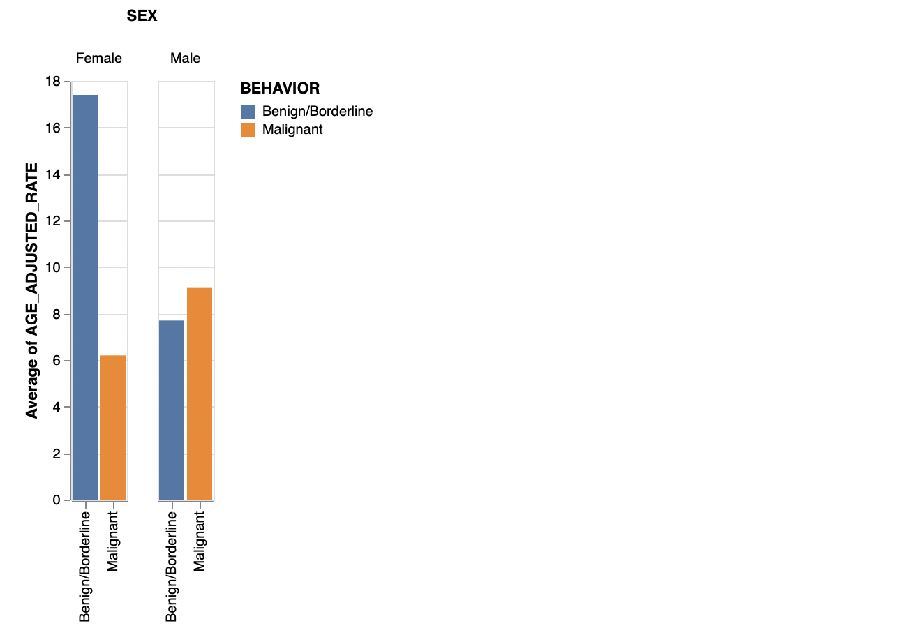
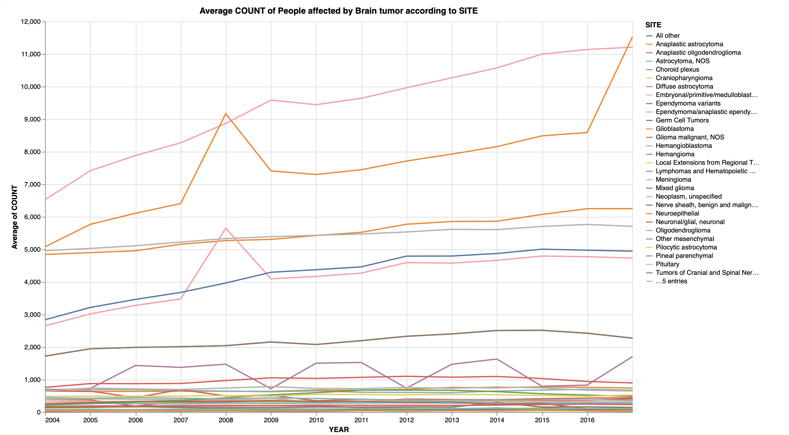

### Step 1: Choose a Dataset

#### Centers for Disease Control and Prevention - United States Cancer Statistics (USCS)
I would like to work on United States Cancer Statistics (USCS). I chose this as this is a general topic where I can understand the data easily compared to others. Since I already did data analysis on covid, I wanna try something different in healthcare topics hat are understandable.

##### Link: [Dataset](https://www.cdc.gov/cancer/uscs/dataviz/download_data.htm)

The dataset contains the data about cancer statistics from 1999 to 2017. The .csv file named as *data* provides the data based on AGE and SEX of people affected by brain cancer in the period of 2004 to 2017.

### Step 2: Start the EDA Process

The original excel folder is taken from the link downloaded. From the dataset link provided above, the data is gathered in an excel file named as *Data Dictionary USCS ASCII 1999-2017.xlsb*. I have saved it as .xlsb as the .xlsx file is too large to push to github. Once the data is loaded and excel sheet is ready, this data is used to observe the visualizations. I am using *Observable* for this homework. 

##### Link: [Notebook](https://observablehq.com/d/57a3078239369d66)

#### Question 1: Considering the SEX, what is the average AGE of a person who developed tumor?

##### Chart created: 

To know the average AGE with respect to SEX, a groupedBar is used to group the SEX and plot BEHAVIOUR against the average AGE-ADJUSTED RATE.

**Observations**: From the plot shown above, it is observed that Benign/Borderline tumor is highly caused in female and Malignant tumor is highly caused in male. The average AGE of male to be identified with Malignant tumor is around 8 to 10 where as Benign/Borderline tumor is around 7 to 8 years. Similarly, The average AGE of female to be identified with Malignant tumor is around 6 where as Benign/Borderline tumor is around 17 to 18 years. 

#### Question 2: What is the average COUNT of the people affected by brain tumor according to the SITE?

##### Chart created: 

For this chart, the only count needed is for a particular year so the data is filtered accordingly. There was also a value "Total" in the dataset that contained the sum of all tumors collectively. The visualization does not require this value as it is not related to this question. I chose this visualization as the tumor would give more details and insight into the growth. A line chart is used because the trend is to be observed in the count. The average COUNT of the people affected by brain tumor can be observed by using BEHAVIOUR or SITE of the tumor. 

Mark color is used to identify one tumor(SITE) from another. This plot needs SEX, the values were thus removed out from the data. The year is shown on the horizontal axis and the average of the COUNT for each SITE on the vertical axis. 

**Observations**: From the plot show above, it is observed that *Meningioma* is the tumor that was identified in the maximum number of people. And the total number of people affected by this tumor has kept on increasing from 2004(~6500) to 2009(~11200). There is a slight depth in 2010(~9500) and it continues to increase in later years up to 2017. 

The second highest observed tumor in the brain is *Tumors of Meninges*. For the year 2008 and 2017, it was observed the highest amount of time. It increases linearly with time except for the year 2008(~9200) where there is a sudden spike in the count and, a considerable drop in the subsequent year 2009(~7400). After this, there has been a linear increase and again a sudden spike in 2017(~11500).

Most variant behavior is observed by one specific tumor which is *Lymphomas and Hematopoietic Neoplasms*. We see a continuous rise and a significant decrease throughout the period. The highest count reached so far was for *Tumors of Meninges* which is around 11,500.

Similarly, *Pituitary* is also amongst the most commonly observed tumor in males as well as females. This tumor also observes a sudden increase in 2008 and later a low is seen in 2009. *Meningioma*, *Tumors of Meninges*, *Pituitary*, *Tumors of Neuroepthelial Tissue*, *Glioblastoma*, *Tumors of Sellar Region* are most observed tumors from the year 2004 to 2017. 

### References:

1. [Marks](https://observablehq.com/@observablehq/plot-marks)
2. [Axis](https://observablehq.com/@alainro/dual-axis-charts)
3. [Color](https://vega.github.io/vega-lite/docs/scale.html)
4. [Filtering](https://observablehq.com/@uwdata/data-types-graphical-marks-and-visual-encoding-channels)
5. [Tooltip](https://observablehq.com/@clhenrick/tooltip-component)

