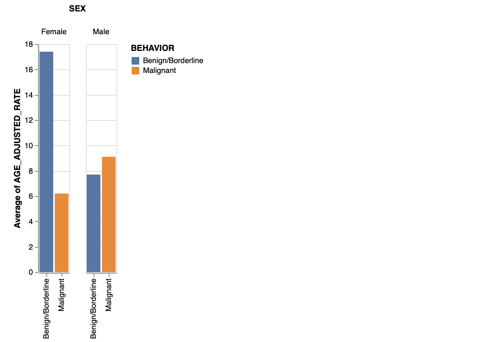
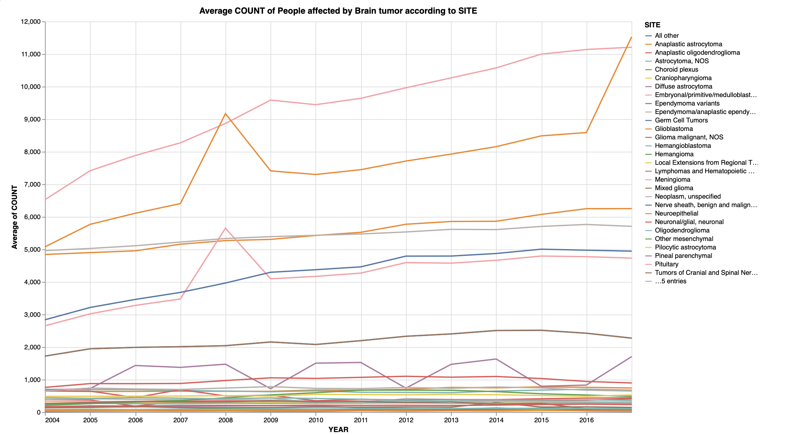

CS625-HW6: Project - Initial Dataset Exploration
================
Priyanka Vepuri
11/16/2021

### Step 1: Choose a Dataset

#### Centers for Disease Control and Prevention - United States Cancer Statistics (USCS)

I would like to work on United States Cancer Statistics (USCS). I chose
this as this is a general topic where I can understand the data easily
compared to others. Since I already did data analysis on covid, I wanna
try something different in healthcare topics hat are understandable.

##### Link: [Dataset](https://www.cdc.gov/cancer/uscs/dataviz/download_data.htm)

The dataset contains the data about cancer statistics from 1999 to 2017.
The .csv file named as *data* provides the data based on AGE and SEX of
people affected by brain cancer in the period of 2004 to 2017.

### Step 2: Start the EDA Process

The original excel folder is taken from the link downloaded. From the
dataset link provided above, the data is gathered in an excel file named
as *Data Dictionary USCS ASCII 1999-2017.xlsb*. I have saved it as .xlsb
as the .xlsx file is too large to push to github. Once the data is
loaded and excel sheet is ready, this data is used to observe the
visualizations. I am using *Observable* for this homework.

##### Link: [Notebook](https://observablehq.com/d/57a3078239369d66)

#### Question 1: Considering the SEX, what is the average AGE of a person who developed tumor?

##### Chart created: 

To know the average AGE with respect to SEX, a groupedBar is used to
group the SEX and plot BEHAVIOUR against the average AGE-ADJUSTED RATE.

**Observations**: From the plot shown above, it is observed that
Benign/Borderline tumor is highly caused in female and Malignant tumor
is highly caused in male. The average AGE of male to be identified with
Malignant tumor is around 8 to 10 where as Benign/Borderline tumor is
around 7 to 8 years. Similarly, The average AGE of female to be
identified with Malignant tumor is around 6 where as Benign/Borderline
tumor is around 17 to 18 years.

#### Question 2: What is the average COUNT of the people affected by brain tumor according to the SITE?

##### Chart created: 

For this chart, the only count needed is for a particular year so the
data is filtered accordingly. There was also a value “Total” in the
dataset that contained the sum of all tumors collectively. The
visualization does not require this value as it is not related to this
question. I chose this visualization as the tumor would give more
details and insight into the growth. A line chart is used because the
trend is to be observed in the count. The average COUNT of the people
affected by brain tumor can be observed by using BEHAVIOUR or SITE of
the tumor.

Mark color is used to identify one tumor(SITE) from another. This plot
needs SEX, the values were thus removed out from the data. The year is
shown on the horizontal axis and the average of the COUNT for each SITE
on the vertical axis.

**Observations**: From the plot show above, it is observed that
*Meningioma* is the tumor that was identified in the maximum number of
people. And the total number of people affected by this tumor has kept
on increasing from 2004(\~6500) to 2009(\~11200). There is a slight
depth in 2010(\~9500) and it continues to increase in later years up to
2017.

The second highest observed tumor in the brain is *Tumors of Meninges*.
For the year 2008 and 2017, it was observed the highest amount of time.
It increases linearly with time except for the year 2008(\~9200) where
there is a sudden spike in the count and, a considerable drop in the
subsequent year 2009(\~7400). After this, there has been a linear
increase and again a sudden spike in 2017(\~11500).

Most variant behavior is observed by one specific tumor which is
*Lymphomas and Hematopoietic Neoplasms*. We see a continuous rise and a
significant decrease throughout the period. The highest count reached so
far was for *Tumors of Meninges* which is around 11,500.

Similarly, *Pituitary* is also amongst the most commonly observed tumor
in males as well as females. This tumor also observes a sudden increase
in 2008 and later a low is seen in 2009. *Meningioma*, *Tumors of
Meninges*, *Pituitary*, *Tumors of Neuroepthelial Tissue*,
*Glioblastoma*, *Tumors of Sellar Region* are most observed tumors from
the year 2004 to 2017.

### References:

1.  [Marks](https://observablehq.com/@observablehq/plot-marks)
2.  [Axis](https://observablehq.com/@alainro/dual-axis-charts)
3.  [Color](https://vega.github.io/vega-lite/docs/scale.html)
4.  [Filtering](https://observablehq.com/@uwdata/data-types-graphical-marks-and-visual-encoding-channels)
5.  [Tooltip](https://observablehq.com/@clhenrick/tooltip-component)
